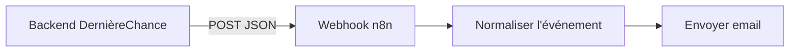

# Notifications par email (n8n)

DernièreChance notifie un webhook pour cinq événements notables :
inscription d'un marchand, inscription d'un client, nouvelle réservation,
panier récupéré au retrait, et anonymisation d'un compte après retrait du
consentement (voir
`backend/src/infrastructure/notifications/webhook_notifier.rs` et
`backend/src/application/ports/event_notifier.rs`). Ce fichier documente
le workflow n8n qui reçoit ces appels et envoie un email pour chacun.

> **`compte_anonymise` : ne jamais enrichir ce message.** Il ne porte que
> l'identifiant technique et le rôle, jamais l'email ni le nom du commerce.
> Y ajouter une donnée identifiante ferait survivre, dans une boîte mail et
> chez le sous-traitant qui l'achemine, précisément ce que l'effacement vient
> de supprimer. Voir `docs/rgpd/registre-traitements.md`.

## Schéma



Payload envoyé par le backend :

```json
{ "event": "nouvelle_reservation", "message": "Nouvelle réservation : \"Panier boulanger surprise\" chez Boulangerie du Marché (code DC-4821)" }
```

Un email part pour **chaque appel reçu** par ce webhook - le filtrage
"notable ou pas" se fait côté backend (quels événements appellent le
webhook), pas dans le workflow n8n lui-même.

## Workflow (n8n Workflow SDK)

Code utilisé pour créer le workflow via l'API n8n. Remplacer
`WEBHOOK_HOST`, `your-email@example.com` et le nom de credential par
les vôtres avant import.

```typescript
import { workflow, node, trigger, sticky, newCredential, expr } from '@n8n/workflow-sdk';

const notifyWebhook = trigger({
  type: 'n8n-nodes-base.webhook',
  version: 2.1,
  config: {
    name: 'Réception Notification DernièreChance',
    parameters: {
      httpMethod: 'POST',
      path: 'derniere-chance-notify',
      responseMode: 'onReceived',
      options: {
        responseData: 'OK',
      },
    },
    position: [240, 300],
  },
  output: [{
    body: {
      event: 'nouvelle_reservation',
      message: 'Un consommateur a réservé "Panier boulanger surprise" chez Boulangerie du Marché (code DC-4821).',
    },
  }],
});

const normalizeEvent = node({
  type: 'n8n-nodes-base.set',
  version: 3.5,
  config: {
    name: "Normaliser l'événement",
    parameters: {
      mode: 'manual',
      includeOtherFields: false,
      assignments: {
        assignments: [
          { id: 'event-type', name: 'eventType', value: expr('{{ $json.body?.event ?? $json.event ?? "action" }}'), type: 'string' },
          { id: 'event-message', name: 'eventMessage', value: expr('{{ $json.body?.message ?? $json.message ?? "" }}'), type: 'string' },
          { id: 'event-details', name: 'eventDetailsJson', value: expr('{{ JSON.stringify($json.body ?? $json, null, 2) }}'), type: 'string' },
          { id: 'received-at', name: 'receivedAt', value: expr('{{ $now.toFormat("dd/MM/yyyy HH:mm:ss") }}'), type: 'string' },
        ],
      },
    },
    position: [540, 300],
  },
  output: [{
    eventType: 'nouvelle_reservation',
    eventMessage: 'Un consommateur a réservé "Panier boulanger surprise" chez Boulangerie du Marché (code DC-4821).',
    eventDetailsJson: '{\n  "event": "nouvelle_reservation"\n}',
    receivedAt: '23/08/2026 11:05:00',
  }],
});

const sendNotificationEmail = node({
  type: 'n8n-nodes-base.gmail',
  version: 2.2,
  config: {
    name: 'Envoyer email de notification',
    parameters: {
      resource: 'message',
      operation: 'send',
      sendTo: 'your-email@example.com',
      subject: expr('DernièreChance - {{ $json.eventType }}'),
      emailType: 'text',
      message: expr('{{ $json.eventMessage }}\n\nReçu le {{ $json.receivedAt }}\n\nDétails bruts :\n{{ $json.eventDetailsJson }}'),
      options: {},
    },
    credentials: { gmailOAuth2: newCredential('Gmail') },
    position: [840, 300],
  },
  output: [{ id: '19abc123', threadId: '19abc000' }],
});

const usageNote = sticky(
  '## Notifications DernièreChance\n\n' +
  'Webhook attend un POST JSON du backend DernièreChance avec\n' +
  '`{ "event": "...", "message": "..." }` (ex: nouvelle_reservation,\n' +
  'nouveau_marchand, nouveau_consommateur, panier_recupere,\n' +
  'compte_anonymise). Un email part\n' +
  'pour CHAQUE appel reçu ici - le filtrage "édifiant ou pas" se fait\n' +
  'côté backend en choisissant quand appeler ce webhook, pas dans ce\n' +
  'workflow.\n\n' +
  "URL à configurer côté backend (variable d'env WEBHOOK_NOTIFY_URL) :\n" +
  'voir l\'onglet Webhook du trigger une fois le workflow publié.',
  [notifyWebhook, normalizeEvent, sendNotificationEmail],
  { color: 4 },
);

export default workflow('derniere-chance-notifications', 'DernièreChance - Notifications par email')
  .add(notifyWebhook)
  .to(normalizeEvent)
  .to(sendNotificationEmail)
  .add(usageNote);
```

## Mise en place

1. Importer ce workflow dans une instance n8n (créer une credential
   Gmail OAuth2, ou adapter le node `Envoyer email de notification`
   pour un autre fournisseur - SMTP, SendGrid, etc.).
2. Publier le workflow ; noter l'URL du webhook affichée sur le node
   trigger (`https://<votre-instance-n8n>/webhook/derniere-chance-notify`).
3. Côté DernièreChance, définir `WEBHOOK_NOTIFY_URL` avec cette URL
   (voir `.env.example`). Vide ou absent = notifications désactivées,
   silencieusement.
