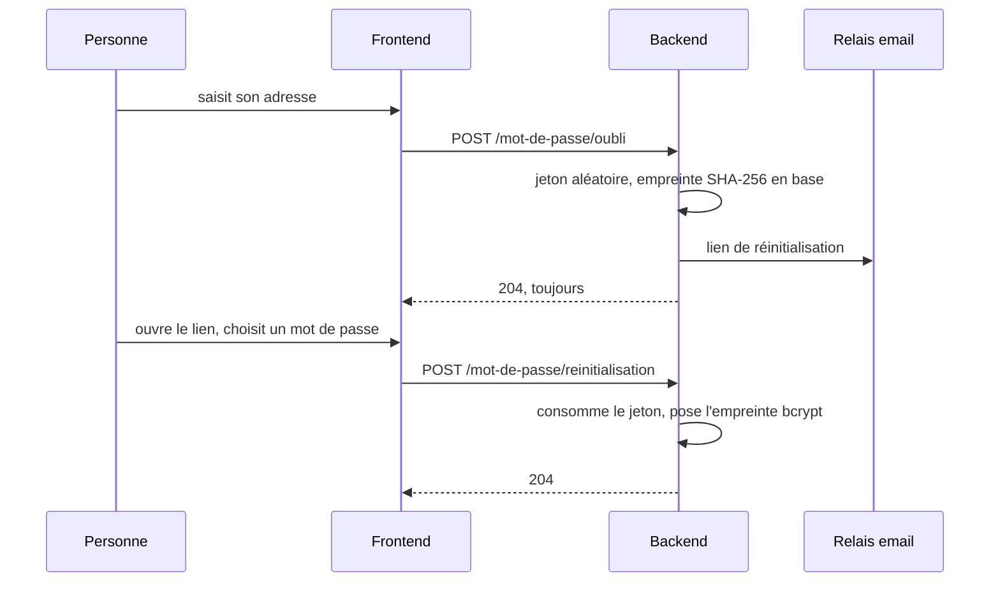

# Réinitialisation de mot de passe

Un client ou un commerçant qui a perdu son mot de passe demande un lien depuis
`/mot-de-passe-oublie`, le reçoit par email, et choisit un nouveau mot de passe
sur `/mot-de-passe?token=...`.

Une seule paire de routes sert aux deux types de comptes : c'est l'adresse qui
désigne le compte, et la personne n'a pas à savoir de quel type il est. Le
compte administrateur en est exclu, il n'est pas auto-inscrit et se recrée par
`ADMIN_EMAIL`/`ADMIN_PASSWORD` (voir `infrastructure/bootstrap.rs`).

## Le parcours

## Ce qui est tenu, et pourquoi

- **La demande ne dit jamais si le compte existe.** Réponse 204 dans tous les
  cas, message de confirmation identique à l'écran. Distinguer les deux ferait
  de ce formulaire un moyen de savoir qui est inscrit, sur un service où la
  seule inscription est déjà une information (« telle personne cherche à
  récupérer des invendus », « tel commerce a des invendus »).
- **L'échec d'envoi n'est pas remonté** non plus, pour la même raison. Il part
  dans les journaux.
- **Le jeton en clair n'existe que dans l'email.** La base n'en garde que
  l'empreinte SHA-256, au même titre qu'un mot de passe ou qu'un refresh token
  OAuth : une fuite de la table ne doit pas suffire à prendre la main sur des
  comptes.
- **Un lien ne vaut qu'une fois, et une heure.** Marquage et lecture se font
  dans la même requête SQL, donc deux ouvertures simultanées du même lien
  n'aboutissent pas toutes les deux.
- **Un changement réussi invalide les autres liens en cours**, y compris celui
  d'une demande faite par un tiers.
- **Un mot de passe refusé ne brûle pas le lien.** La validation passe avant la
  consommation du jeton : sinon une faute de saisie obligerait à redemander un
  email.
- **Deux demandes rapprochées n'envoient qu'un email** (délai de garde de
  2 minutes). Sans ce garde-fou, rejouer le formulaire ferait pleuvoir des
  messages sur l'adresse d'un tiers, et l'application n'a pas de limitation de
  débit ailleurs.
- **Un compte anonymisé reste hors de portée.** Le retrait du consentement
  remplace l'adresse par une valeur dérivée de l'identifiant, donc aucune
  recherche par email ne le retrouve ; et `UPDATE ... WHERE anonymise_le IS
  NULL` refuse de le toucher même si un chemin applicatif y menait. Un retrait
  de consentement ne doit pas pouvoir se défaire par une réinitialisation.

## Longueur minimale

`domain/services/password.rs` impose 12 caractères, comptés en caractères et
non en octets pour que les lettres accentuées ne comptent pas double. La
longueur plutôt que la complexité imposée, comme le recommandent l'ANSSI et le
NIST, d'autant qu'il n'y a ici ni second facteur ni limitation de débit sur la
connexion.

La même règle vaut à l'inscription, client comme marchand : un compte ne doit
pas pouvoir naître avec un mot de passe que ce parcours refuserait ensuite.

**Elle ne s'applique pas à la connexion**, volontairement. Les comptes créés
avant cette règle gardent un mot de passe plus court, qui reste valable : le
leur refuser les enfermerait dehors. C'est pourquoi le `minlength` du
formulaire n'est posé qu'en mode inscription.

## Le lien ne doit pas retomber en clair

Les pages statiques sont servies par nginx derrière Traefik, et nginx ne voit
que du HTTP : ses redirections absolues renvoyaient vers `http://`. Le lien de
réinitialisation portant le jeton dans la query string, ouvrir
`https://.../mot-de-passe?token=...` produisait une redirection vers
`http://.../mot-de-passe/?token=...`, donc une requête en clair transportant le
jeton avant que Traefik ne relève la connexion. `absolute_redirect off` dans
`frontend/nginx.conf` rend la redirection relative : le navigateur conserve le
schéma en cours. Cela vaut pour toutes les pages à paramètres, pas seulement
celle-ci.

Il n'y a pas d'en-tête `Strict-Transport-Security` sur le domaine. L'ajouter au
Traefik partagé serait la ceinture par-dessus les bretelles, mais cela touche
aussi les autres services fronted par la même instance : à décider à part.

## Ce qui n'est pas fait

- **Aucune limitation de débit globale.** Le délai de garde protège une adresse
  donnée, pas le point d'entrée lui-même : rien n'empêche d'énumérer des
  adresses au rythme du réseau. À traiter au niveau de Traefik ou de CrowdSec
  si le service s'ouvre au-delà du bêta.
- **Les jetons JWT déjà émis restent valables** après un changement de mot de
  passe : ils sont signés et sans état côté serveur, donc irrévocables avant
  leur expiration (30 jours). Quelqu'un déjà connecté sur un appareil y reste.
  Les révoquer supposerait une liste de révocation ou un compteur de version
  par compte.

## Où c'est

| Quoi | Où |
|---|---|
| Règle métier | `backend/src/application/use_cases/password_reset_use_cases.rs` |
| Longueur minimale | `backend/src/domain/services/password.rs` |
| Port et stockage | `application/ports/password_reset_repository.rs`, `infrastructure/database/repositories/password_reset_repository_impl.rs` |
| Schéma | `backend/migrations/0009_reinitialisation_mot_de_passe.sql` |
| Gabarit de l'email | `backend/src/infrastructure/email/message.rs` |
| Routes | `POST /mot-de-passe/oubli`, `POST /mot-de-passe/reinitialisation` |
| Écrans | `frontend/src/components/ForgotPassword.svelte`, `ResetPassword.svelte` |
